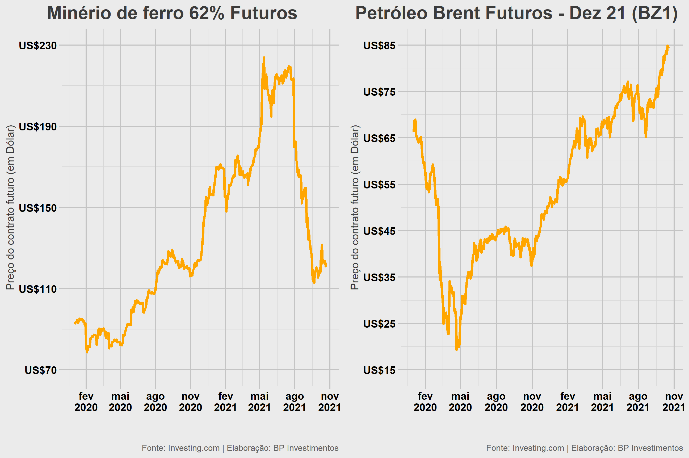

background-image: url(“bp\_capa.png”) background-size: contain

------------------------------------------------------------------------

   

------------------------------------------------------------------------

   

|                                                                         |
|-------------------------------------------------------------------------|
|                                                               |
|  |

   

|                                                                         |
|-------------------------------------------------------------------------|
|                                                               |
|  |

   

   

|                                                                          |
|--------------------------------------------------------------------------|
|                                                                |
|  |

background-image: url(“commodities.png”) background-position: center
background-size: contain

------------------------------------------------------------------------

   

------------------------------------------------------------------------

   

------------------------------------------------------------------------

   

   

|                                                                          |
|--------------------------------------------------------------------------|
|                                                                |
|  |

   

   

|                                                                          |
|--------------------------------------------------------------------------|
|                                                                |
|  |

background-image: url(“final.png”) background-position: center
background-size: contain
